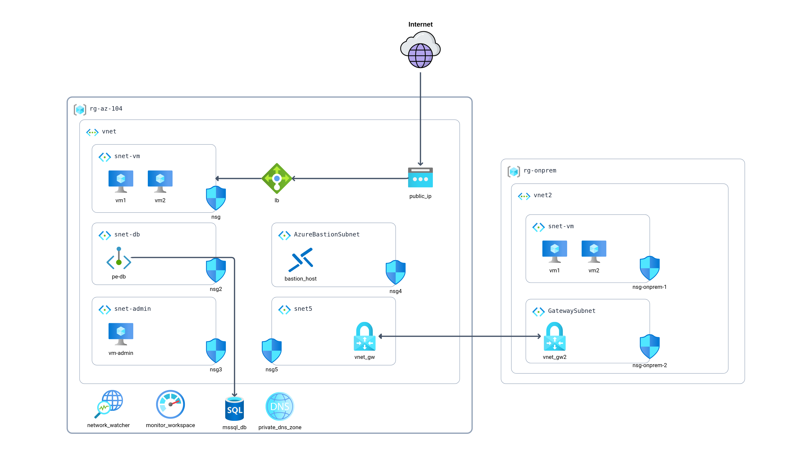

# Azure Networking Project

### Objective
Design a hybrid networking environment where on-premises networks connect securely to Azure resources using Azure's networking capabilities, ensuring secure data transition and effective resource access controls.

### Azure Services Used
- Azure Virtual Networks
- Azure VPN Gateway
- Network Security Groups (NSGs)
- Azure Bastion
- Azure Private Link
- Azure DNS
- Azure Load Balancer

### Architecture

### Steps

1. Azure Virtual Network Setup:
- Provisioned an Azure Virtual Network (VNet) in chosen region.
- Created multiple subnets within this VNet to segregate resources effectively (e.g., WebApp Subnet, Database Subnet, Admin Subnet).

2. On-Premises Network Simulation:
- For the sake of this project, used another VNet to simulate on-premises environment. This can be in another Azure region or the same region based on preference.

3. Secure Connectivity:
- Implemented Azure VPN Gateway to create a site-to-site VPN connection between simulated on-premises environment (VNet) and main Azure VNet.
- Verify the connection and ensure resources from one VNet can communicate with another, effectively simulating a hybrid environment.

4. Resource Deployment
- Deployed test resources (like VMs) in each subnet of main Azure VNet. For instance, deploy a web server VM in the WebApp Subnet, a database in the Database Subnet, etc.

5. Network Access Control:
- Used Network Security Groups (NSGs) to define inbound and outbound access rules for each subnet, ensuring that only valid traffic is allowed. For instance, only allow HTTP/HTTPS traffic to the WebApp Subnet.

6. Secure Administrative Access:
- Azure Bastion for secure and seamless RDP and SSH access to virtual machines, ensuring to not expose the VMs to the public internet.

7. Private Access to Azure PaaS Services:
- Used Azure Private Link to access Azure PaaS services (like Azure SQL Database) over a private endpoint within VNet, ensuring data doesn't traverse over the public internet.

8. DNS and Load Balancing:
- Configured Azure DNS to have custom domain names for your resources.
- Implemented Azure Load Balancer to distribute traffic across VMs in the WebApp Subnet.

9. Monitoring and Auditing:
- Enable monitoring and diagnostics on VPN Gateway, NSGs, and other network resources to gain insights into network operations.